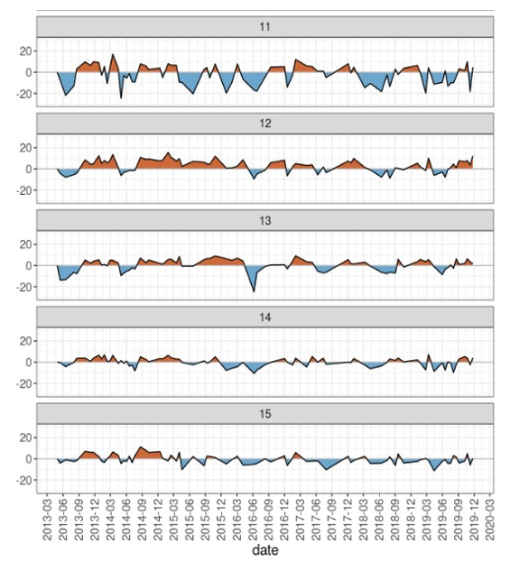
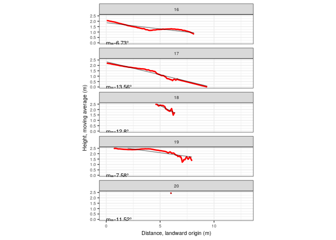

**Carolain Pérez Ureña**
*Estudiante, Universidad Autónoma de Santo Domingo (UASD)*

Resumen: Se ha estudiado la transformación de la línea costera en playa Najayo específicamente en la parte de los pescadores, San Cristóbal, sur de República Dominicana. Se efectuaron diferentes métodos para una evaluación más precisa de la vulnerabilidad y riesgo que tiene esta zona litoral. Entre los cuales se usaron el estudio de imágenes satelitales hechas entre los años 2013-2019, análisis granulométrico, delimitación de la costa, generación de perfiles de playa, entre otras herramientas digitales. Se ha evidenciado un cambio en la playa y un proceso de retrogradación y progradación importante en estos últimos siete años, se determinó que los fenómenos meteorológicos, la crecida del nivel del mar, la dirección del viento, la circulación de las corrientes,  y la actividad humana son influyentes en dicho cambio.


# Introducción

La playa es la zona donde se depositan y se acumulan sedimentos arrastrados principalmente por las olas. Estos sedimentos pueden ser finos o gruesos. Es fundamental que la acumulación de material sea mayor que la erosión en el litoral costero para la formación de una playa, así como su área geomórfologica en conjunto.

La franja de tierra que tiene contacto e interacción con el medio acuático es la costa. Por tanto, es en esta parte de la playa donde más cambios se registran, tanto a escala geológica como histórica ancestral y reciente. El origen de estas transformaciones son debidas principalemnte por la oscilación de aguas marinas [@pedraza1996geomorfologia]. Los efectos de estas alteraciones se traducen en un retroceso acelerado de la costa, que se evidencia a través de registro de imágenes aéreas, las cuales se analizan para dar seguimiento a los cambios ocurridos en las costas[@ortiz1992retroceso].


La convergencia entre la zona marina y la terrestre produce unos fenómenos que tienden a afectar las costas, conocidos como procesos físicos litorales. Entre estos se distinguen los de tipo marítimo (oleaje, corrientes, mareas) geológios (tsunamis), climáticos (vientos, huracanes) y continentales (erosión hídrica y depósito de sedimentos fluviales).


Los cambios más significativos en los últimos años son producidos por la crecida del nivel del mar, así como por la presión de las olas que provoca el desgaste y sedimentación en las costas. Esta acción hidráulica provoca una modelación fisiográfica, que según @pedraza1996geomorfologia puede dar lugar a distintos tipos de costas como por ejemplo de ría, de fiordo, de cala, de isla barrera, arenosas o playas estabilizadas, de delta, entre otras. Por otra parte, según su dinámica, las costas se clasifican en de progradación, estacionaria y de retrogradación [@codignotto1997geomorfologia].


En determinadas condiciones se acumula *beachrock* o roca de playa, la cual es una roca sedimentaria friable bien cementada que consiste en una mezcla variable de sedimento de grava, arena y limo cementada con minerales de carbonato. El carbonato de calcio se encarga de fosilizar el *beachrock*, dando lugar a playas rocosas. Dependiendo de la ubicación, el sedimento puede consistir en una mezcla variable de conchas, fragmentos de coral, fragmentos de roca de diferentes tipos y otros materiales [@jackson2005glossary]. En las costas en retirada, los afloramientos de roca de playa pueden ser evidentes en alta mar donde actúan como una barrera contra la erosión costera. La presencia de roca de playa también puede inducir deficiencia de sedimento en una playa y sincronizar su régimen de olas. 


El litoral sur de República Dominicana contiene playas idóneas para el estudio de los fenómenos y tipos de depósitos mencionados. Un caso típico es la playa Najayo, la cual es una pequeña ensenada labrada en forma de "muesca" dentro del sistema de terrazas arrecifales plio-cuaternarias del litoral sur dominicano, en la provincia San Cristóbal, región administrativa de Valdesia. Litológicamente, la playa y su entorno están compuestos de arena y gravas bioclásticas formando el cordón litoral, en el fondo de valle conglomerado, gravas, arenas, caliza arrecifal, calciruditas y calcarenitas [@mollat2004mapa] (ver figura \ref{mapa_geologico}).

{height=350px}


La playa de Najayo limita al norte con una costa acantilada, y se extiende al sudoeste siguiendo un trazado relativamente recto, con algunas interrupciones donde afloran rocas del sustrato y depósitos de playa tipo beachrock. Convencionalmente, se divide en dos sectores: 1) Playa de los Pescadores, que ocupa los dos tercios septentrionales del área, donde también desemboca el arroyo Rolón, y donde se localizan algunos afloramientos de beachrock; 2) Playa de Carlos Pinto, que ocupa el tercio meridional y que contiene la desembocadura del arroyo del mismo nombre. Este trabajo se concentra específicamente en la playa de Los Pescadores. Se caracteriza por tener una vegetación predominante con *Terminalia catappa* (ver figura \ref{Almendra}), *Ipomoea sp.* (ver figura \ref{Ipomea}), la introducida *Morinda citrifolia* (conocida como None) (ver figura \ref{None}), entre otras especies de plantas.


{height=250px}

{height=250px}


{height=250px}

{height=250px}

{height=250px}


Tras una revisión del conocimiento local expresado por lugareños, así como por medio de información colectada en campo y de imágenes satelitales, se hipotetiza que esta playa ha experimentado cambios en el trazado de su línea de costa durante los últimos 6 años. Asimismo, también se hipotetiza que existe una sustancial variabilidad espacial de la inclinación y la concavidad del perfil de playa. Igualmente, se formula la hipótesis de que la variabilidad observada en la distribución de la granulometría de los sedimentos de la playa se debe se atribuye a la relación del litoral con la desembocadura del arroyo Rolón. Finalmente, también se hipotetiza que el beachrock encontrado en esta playa podría atribuirse a descargas locales carbonatadas, posiblemente de acuíferos o de fuentes superficiales. En tal sentido, para el presente estudio, se formularon las siguientes preguntas:"

¿A qué se debe la diferencia de granulometria entre sedimentos en distintos lugares de la playa?

¿Afectan los ciclones y los eventos de lluvias extremas no ciclónicas en el trazado de línea de costa?

Si se han registrado cambios, ¿en qué año se registró el evento más significativo que ha producido variación en el trazado de linea de costa?

¿En qué parte de la playa se registran las mayores pendientes? ¿Por qué? 

¿Por qué el Beachrock se localiza en el centro? ¿De qué está compuesto?


# Metodología

Se realizó una extensa revisión bibliográfica para conocer aspectos geológicos y geomorfológicos sobre las costas de Najayo, así como para situar el estado de conocimiento sobre esta poco reconocida localidad.

Para el estudio se aplicaron diversos métodos y se utilizaron varios materiales, entre los cuales se incluyen: descripción general de la costa, recogida de muestras de clastos, anotaciones, colecta de coordenadas de precisión submétrica, compilación de líneas de costa históricas mediante teledetección y análisis de cambio, realización de vuelo con drone, generación ortofotografías y restitución fotogramétrica.

Para la descripción general de la costa se colectaron muestras de sedimentos a lo largo de la playa a intervalos regulares de aproximadamente 70 metros. Se recogió un número máximo de cinco muestras en lugares diferentes de la playa, tanto en la berma como en la ribera. En cada espacio seleccionado se le asignaron un código para identificar las muestras (ver figura \ref{mismuestrass}). Las tres localidades occidentales se situaban cerca de la desembocadura del arroyo Rolón, y las dos del extremo oriental, próximas a las costas acantiladas. Se procedió a medir con una regla el largo y ancho de varios clastos escogidos. Descartando aquellos con un tamaño inferior a 10 mm.

{height=300px}


Para colectar sedimentos se utilizaron bolsas Whirl Pak de 540 ml(18oz), 4.5 pulgadas de ancho por 9 de largo, sobre las cuales se anotó con tinta indeleble, código y fecha de colecta. Con la ayuda de la aplicación ODK Collection se completó un formulario con los datos referentes a las coordenadas,código de muestra, hora de colecta, fecha, localidad y dueño de muestra. 

Para fines de obtener coordenadas precisas se marcaron con pintura en aerosol siete puntos en orden numérico a lo largo de la playa, y utilizando un receptor de navegación satelital con tecnología RTK, se obtuvo las coordenadas exactas de los lugares marcados. 

Para analizar los cambios de trazado de la linea de costa, se compilaron imagenes satelitáles de Landast 8 de los años 2013 a 2019, se usaron para la detección de cambios ocurridos entre años pasados y la actulidad. Para llevar a cabo el análisis de las modificaciones, fue necesario delimitar la linea costera de la playa utilizando la herramienta CoastSat [@kilian_vos_2019_3560436]. Estas demarcaciones fueron limpiadas y hechas en Qgis (ver figura \ref{lineas_najayo}).

{height=300px}


Empleando el método de transectos lineales se recolectó información del cambio dinámico que tiene el litoral en un periodo de siete años cada tres meses. Se hacen trazados perpendiculares a la costa en la imágen, y con las delimitaciones del litoral se toma una linea de referencia, se estima la distancia entre ella y otra linea cualquiera. Finalmente, tanto los transectos como las líneas fueron analizadas en R utilizaron el script RCoastSat [@jose_ramon_martinez_batlle_2020_3937481], el cual produjo resultados gráficos que facilitaron la interpretación. 

Para responder las preguntas sobre pendiente y su distribución a lo largo de la línea de costa, se realizó un vuelo con drone a lo largo de la playa. De esta manera fueron tomadas imágenes aéreas con un drone cuadrictéro modelo DJI Phantom 4, que cubrieron toda el área de la costa. Para la correcta generación de ortofotografías y la restitución fotogramétrica, se utilizaron coordenadas adquiridas con el sistema de navegación mencionado, las cuales alimentaron el flujo de trabajo del paquete OpenDroneMap.

Usando el DSM generado en OpenDroneMap y transectos en QGIS, con herramientas visuales (Profile Tool en Qgis) mediante programación en R para análisis por lote [@jose_ramon_martinez_batlle_2020_3937481] se generaron perfiles de playa. Estas herramientas generan gráficos de perfil de elevación que muestran la pendiente, una tabla de datos asociados, así como cálculos de concavidad de perfil.


# Resultados

Los datos fueron agrupados en tres secciones de acuerdo, siguiendo los temas formulados en el estudio: granulometría, cambios de trazado de la línea de costa y perfiles de playa.

## Granulometría

Con las muestras ya recolectadas se procede a realizarse un análisis granulométrico tomando medidas del largo y ancho de un total de 50 clastos. El estudio comparativo fue realizado contrastando las mediciones de los clastos en dos unidades bien diferenciadas:berma costera y frente de playa (incluyen ribera) n dos unidades geomorfológicas berma costera y la ribera (ver figura \ref{ab_por_muestras}).


```{r, eval=T, echo=F, fig.show='hold', results='hide', warning=F, message=F, fig.width=6, fig.cap="\\label{ab_por_muestras}Dimensiones largo/ancho según muestras"}
library(jsonlite)
library(tidyverse)
df <- jsonlite::fromJSON('cantometria_ultimo.json', flatten = TRUE)
df %>% filter(!grepl('^C2.*M1$|^AV.*$', codigomuestra), grepl('T23', df$fechahora)) %>% unnest(clastos) 
df  %>% filter(!grepl('^C2.*M1$|^AV.*$', codigomuestra), grepl('T23', df$fechahora)) %>% unnest(clastos) %>%
  select(`Codigo de lugar`=codigomuestra, `Largo (a)`=a, `Ancho (b)`=b) %>%
  group_by(`Codigo de lugar`) %>%
  mutate('Codigo de lugar n'=paste0(`Codigo de lugar`, ' (n=', length(`Codigo de lugar`), ')')) %>% 
  ungroup() %>% select(-`Codigo de lugar`) %>% gather(eje, `valor (en mm)`, -`Codigo de lugar n`) %>%
  ggplot() + aes(x = eje, y = `valor (en mm)`) + geom_boxplot() +
  facet_grid(~`Codigo de lugar n`) + theme_bw() +
  theme(text = element_text(size = 12))

```


En la muestra de 01CPU13 (perteneciente a berma costera oriental) fueron medidos 17 clastos con un promedio de tamaño entre 10 mm a 18 mm de ancho, y 18 mm a 25 mm de largo y una mediana de 22 cm de largo. Se identifican que dos clastos medidos en esta muestra tenían un ancho de 04 y 05 mm más pequeño que la mayor parte y solo uno con una dimensión en 18 mm. En cambio se verifica un elemento con 39 mm de largo.

La segunda muestra colectada 02CPU13 se localiza en la berma central de duna, se midieron seis elementos de los cuales el promedio en ancho es de 10 a 12 mm y el largo de 15 a 20 mm. En esta colecta el 75% de los clastos mide menos de 20 mm de ancho y largo.

La cuarta muestra 04CPU13 se ubica frente al antiguo canal del arroyo Rolón perteneciente a la ribera, se tomaron mediciones de 6 sedimentos, cuyos resultados dieron una mediana de 11mm para ancho y 16 mm para ancho. Todos midieron por debajo de 20 mm siendo estos los clastos más pequeños de todos los recolectados.

La última muestra colectada llamada 05CPU13 se encuetra en la berma occidental de la playa, en total se midieron 17 elementos. El rango de valores se encuentra entre los 10 a 20 mm en ancho con solo un valor atípico de 28 mm. En cambio la media en el largo fue de 25 mm a 35 mm, es decir que un 50% de los sedimentos media entre ese rango de valor.


```{r, eval=T, echo=F, fig.show='hold', results='hide', warning=F, message=F, fig.width=6, fig.cap="\\label{ab_por_playas}Dimensiones largo/ancho según playas"}
todo <- jsonlite::fromJSON('cantometria_ultimo.json', flatten = TRUE)
playacarlopinto <- todo %>% filter(grepl('^AV.*$', codigomuestra)) %>%
	  unnest(clastos) %>% mutate(playa='p. Carlos Pinto')
  playadelospescadores <- todo %>% filter(grepl('^0.*CPU', codigomuestra)) %>%
	    unnest(clastos) %>% filter(a>=10)  %>%  mutate(playa='p. Los Pescadores')
    ambasplayas <- bind_rows(playacarlopinto, playadelospescadores)
    ambasplayas %>% dplyr::select(a, b, playa) %>% gather(dimension, valor, -playa) %>%
	      ggplot() + aes(x=playa, y=valor) + geom_boxplot() + facet_grid(~dimension) +
	        theme_bw() + theme(text = element_text(size = 12)) + ylab('valor (en mm)')

```

Se identifica una variación del tamaño de sedimentos en cada muestra de las dos playas, donde se presentan valores más grandes tanto en ancho como largo en la playa los Pescadores. En cambio en la playa Carlos Pinto los clastos tienen un promedio menor en ambas dimensiones. 

Los patrones correspondientes al eje largo en la laya Carlos Pinto miden menos de 11mm en el 25% de sus clastos, menos de 14 mm en el 50% y no superaban los 18 mm en un 75% de sus elementos. En esta misma variable en la playa los pescadores más del 50% de los clastos superaban los 20 mm. En la variable ancho los clastos poseen un promedio de ente 9 a 12 mm en la playa Carlos Pinto, destacandose algunos valores atípicos. En la otra playa un 75% tienen un ancho de menos de 15 mm (ver figura \ref{ab_por_playas}).

## Cambios de trazado de la línea de costa

En cuanto al análisis de los cambios de trazado de la línea de costa, se tomó como referencia una la línea del año 2013. La intersección entre el transecto y cada linea que tiene asociada se forma un punto que contiene un valor de fecha. El total de transectos trazados fueron 15, tomados desde la desembocadura del arroyo Rolón hasta unos 10 metros al oeste. Los presentados en azul representan el nivel de retirada del mar, de modo que, una progradación de la costa y los de color marrón representan el avance del mar hacia tierra (ver figuras \ref{transectosdplaya1}, \ref{transectosdplaya2} y \ref{transectosdplaya3}). Con esta información se muestra si hay evidencia de retrogradación, progradación o por defecto estacionaliddad en un periodo de siete años. A forma de cuadro se realizan descripciones de los cambios por trimestre de cada año, se observa que  entre septiembre y diciembre de todos los años la transgresión marina es más notable que en otros meses, por el contrario, los meses de marzo a junio el hay una regresión marina de escasos metros (ver figuras \ref{transectosdecambiocosta} y \ref{transectosNayajo}).


{height=500px}
 
 
{height=500px}


{height=500px}


{height=400px}
 

{height=500px}


## Perfil de playa

Se extrajeron perfiles de playa de un modelo digital de superficie, donde se muestra la generación 20 perfiles topográficos divididos en 4 plots de 5 paneles cada uno de la playa de Los pescadores. Las observaciones de los paneles indican que se mantiene una tendencia de bajada a medida que se aproxima al occidente del litoral, entre los transectos 6 a 12 la pendiente queda casi completamente tendida llegando a 0.5 metros en el transecto 12, a partir del transecto 13 la pendiente se vuelve ligeramente más pronunciada, llegando alcanzar valores superiores a 2.5 metros en el transecto 17 (ver figuras \ref{transectos-mapa}, \ref{transectos-perfil1}, \ref{transectos-perfil2}, \ref{transectos-perfil3} y \ref{transectos-perfil4}).

En estos grupos de subtipos de transectos a escalas iguales entre paneles del mismo plot (no vertical exaggeration), usan los mismos límites para sus ejes entre paneles (transectos), los valores para el eje x van desde 0 a 3.5 metros, el eje y es igual. Estos gráficos son útiles para saber, por ejemplo, cuáles transectos llegan al nivel cero arbitrario y cuáles no, así como para comparar cuáles tienen mayor desplazamiento horizontal y cuáles tienen menos.


{height=300px}


{height=800px}

{height=800px}


{height=800px}


{height=800px}


{height=400px}


# Discusión

Se formularon diversas hipótesis para las preguntas planteadas. Para la pregunta sobre la diferencia de tamaños de los clastos en las dos playa, se sostiene que los sedimentos del continente fueron arrastrados por el arroyo Rolón de manera constante hasta ser depositados en la costa de la playa los pescadores. En cambio, el arroyo de agua dulce que desembocaba en la playa de Carlos Pinto se vió afectado por un estancamiento por la acumulación de sedimentos. Hay registro de que el cauce del arroyo Rolón es más amplió y su cuenca es mayor que la de arroyo de agua dulce, por otro lado, la deriva predominante viene de los vientos del nordeste, que con el oleaje y el cambio brusto de refracción produce acumulación en la ensenada en la playa los pescadores, mientras que en Carlos Pinto este oleaje llega ya reflactado lo hace que su erosión y posterior acumulación sea mucho menor. Esto puede explicar la variación de tamaño de sedimentos en ambas playas.  


De acuerdo con [@carranza2010causas] la velocidad de erosión en las playas puede variar considerablemente en el espacio y tiempo, así, los huracanes pueden tener una respuesta inmedianta en la erosión de las playas. En consideración a esto, el cambio más notable de progradación del mar se registra en el trimestre de junio-septiembre del 2016, periodo en el que superó los 20 metros de distancia, presuntamente por el huracán Mathew de categoría cinco ocurrido en en septiembre del 2016.
  

Diversas investigaciones sostienen que el *beachrock* de la playa está compuesto por basalto, fósiles arrastrados, rocas alteradas, tonalitas, calizas, rocas intrusivas fosilizada por carbonato de calcio usual en la región sur de la Republica Dominicana y propio del periodo pleistoceno. Todos estos materiales fueron depositados y empastados por el carbonato del continente y otros arrastrasdos por el mar desde el rio. Se localiza en el centro (entre punta y punta de la playa Najayo) porque es donde afloran las calizas con mayor claridad.

Para concluir, la playa presenta un perfil de forma concava, teniendo mayor pendiente es en la berma frente al Antiguo Canal del arroyo. El transporte de sedimento desde el arroyo hasta llegar al mar generan una acumulación de estos en esta parte de la berma.

# Agradecimientos

En primer lugar quiero agradecer al profesor José Ramón Martinez Battle del área de las ciencias geográficas de la Universidad Autónoma de Santo Domingo por tener la iniciativa, propiciar las investigaciones y facilitar las herramientas para este estudio.

También le agradezco a la facultad de Ciencias y la escuela de geografía de la Universidad Autónoma de Santo Domingo por ser fuente de formación de profesionales en esta área. 

Por último agradezco a la estudiante de Ciencias Geográficas Ana Valera por sumarse y ser de ayuda idónea en las investigaciones hechas en esta playa.


# Información de soporte

\ldots

# *Script* reproducible
```{r,eval=FALSE}

library(jsonlite)
library(tidyverse)
df <- jsonlite::fromJSON('Cantometría_3_results.json', flatten = TRUE)
df %>% filter(!grepl('^C2.*M1$|^AV.*$', codigomuestra), grepl('T23', df$fechahora)) %>% unnest(clastos) %>% View()
df  %>% filter(!grepl('^C2.*M1$|^AV.*$', codigomuestra), grepl('T23', df$fechahora)) %>% unnest(clastos) %>%
  select(`Codigo de lugar`=codigomuestra, `Largo (a)`=a, `Ancho (b)`=b) %>%
  group_by(`Codigo de lugar`) %>%
  mutate('Codigo de lugar n'=paste0(`Codigo de lugar`, ' (n=', length(`Codigo de lugar`), ')')) %>%
  ungroup() %>% select(-`Codigo de lugar`) %>% gather(eje, `valor (en mm)`, -`Codigo de lugar n`) %>%
  ggplot() + aes(x = eje, y = `valor (en mm)`) + geom_boxplot() +
  facet_grid(~`Codigo de lugar n`) + theme_bw() +
  theme(text = element_text(size = 18))


Packages
library(tidyverse)
library(purrr)
library(sf)
library(RColorBrewer)
library(raster)
Read the functions
funs <- list.files('R', pattern = '*.R', full.names = T)
map(funs, source)
atransprof <- rtrans('data/perfil_los_pescadores.geojson')#Digitized by Carolain, edited by geofis
## Reading layer `transectos_ortofotos' from data source `/home/jr/Documentos/git/BeachProfile/data/perfil_los_pescadores.geojson' using driver `GeoJSON'
## Simple feature collection with 20 features and 1 field
## geometry type:  LINESTRING
## dimension:      XY
## bbox:           xmin: 383443.4 ymin: 2024230 xmax: 383656.2 ymax: 2024320
## epsg (SRID):    32619
## proj4string:    +proj=utm +zone=19 +datum=WGS84 +units=m +no_defs
rawDsm <- raster('data/raw-dsm-pescadores.tif')
dsm <- thresholdRaise(rasterDsm = rawDsm, threshold = -44.1)
plot(dsm)
plot(as_Spatial(transprof), add=T)

```
 
{height=300px}

```{r, eval=F}


#ggplot of transects
cols <- colorRampPalette(brewer.pal(9,'Set1'))(nrow(transprof))
ggplot() +
  geom_sf(data = transprof, color = cols) +
  scale_color_manual(values = c('black', 'orange', 'blue')) +
  geom_sf_text(
    data = transprof %>%
      st_centroid, aes(label = transect), size = 3) +
  theme_minimal() +
  theme(legend.title = element_blank())
## Warning in st_centroid.sf(.): st_centroid assumes attributes are constant
## over geometries of x
```
{height=300px}

```{r, eval=F}

Profile data
profData_temp <- profiles(transects = transprof, height = dsm,
                          pointsPerPixel= 2, movingAvgK = 3)
## rgeos version: 0.5-1, (SVN revision 614)
##  GEOS runtime version: 3.6.2-CAPI-1.10.2 
##  Linking to sp version: 1.3-1 
##  Polygon checking: TRUE
## 
## Attaching package: 'scales'
## The following object is masked from 'package:purrr':
## 
##     discard
## The following object is masked from 'package:readr':
## 
##     col_factor
## 
## Attaching package: 'zoo'
## The following objects are masked from 'package:base':
## 
##     as.Date, as.Date.numeric
## udunits system database from /usr/share/xml/udunits
profData_temp
## $dimension
## # A tibble: 2,603 x 5
##    transect       dist        h      hma     distlm
##    <fct>           [m]      [m]      [m]        [m]
##  1 1        0.00000000 2.447498       NA         NA
##  2 1        0.04982810 2.447498 2.447221 0.04982810
##  3 1        0.09965621 2.446667 2.446944 0.09965621
##  4 1        0.14948432 2.446667 2.436445 0.14948432
##  5 1        0.19931242 2.416000 2.426222 0.19931242
##  6 1        0.24914053 2.416000 2.402000 0.24914053
##  7 1        0.29896863 2.374001 2.388000 0.29896863
##  8 1        0.34879674 2.374001 2.352666 0.34879674
##  9 1        0.39862484 2.309998 2.331332 0.39862484
## 10 1        0.44845295 2.309998 2.291665 0.44845295
## # … with 2,593 more rows
## 
## $dimensionless
## # A tibble: 2,603 x 3
##    transect   distlm    hma
##    <fct>       <dbl>  <dbl>
##  1 1        NA       NA    
##  2 1         0        1    
##  3 1         0.00678  1.000
##  4 1         0.0136   0.996
##  5 1         0.0203   0.991
##  6 1         0.0271   0.982
##  7 1         0.0339   0.976
##  8 1         0.0407   0.961
##  9 1         0.0475   0.953
## 10 1         0.0542   0.936
## # … with 2,593 more rows
## 
## $dimensionlessrawdistance
## # A tibble: 2,603 x 3
##    transect   dist    hma
##    <fct>     <dbl>  <dbl>
##  1 1        0      NA    
##  2 1        0.0143  1    
##  3 1        0.0286  1.000
##  4 1        0.0429  0.996
##  5 1        0.0571  0.991
##  6 1        0.0714  0.982
##  7 1        0.0857  0.976
##  8 1        0.1000  0.961
##  9 1        0.114   0.953
## 10 1        0.129   0.936
## # … with 2,593 more rows
## 
## $concavityindex
## # A tibble: 20 x 2
##    transect       ci
##    <fct>       <dbl>
##  1 1         0.0136 
##  2 10        0.188  
##  3 11        0.371  
##  4 12        0.281  
##  5 13        0.149  
##  6 14        0.0692 
##  7 15        0.127  
##  8 16        0.0530 
##  9 17       -0.0744 
## 10 18       -0.0256 
## 11 19       -0.0809 
## 12 2         0.0173 
## 13 20        0.0441 
## 14 3         0.00273
## 15 4        -0.0295 
## 16 5        -0.0686 
## 17 6        -0.0428 
## 18 7         0.0276 
## 19 8         0.0960 
## 20 9         0.0880 
## 
## $concavityindexrawdistance
## # A tibble: 20 x 2
##    transect      ci
##    <fct>      <dbl>
##  1 1        -0.454 
##  2 10        0.196 
##  3 11        0.381 
##  4 12        0.290 
##  5 13        0.0927
##  6 14       -0.0533
##  7 15       -0.267 
##  8 16       -0.335 
##  9 17       -0.364 
## 10 18       -0.605 
## 11 19       -0.693 
## 12 2        -0.261 
## 13 20       -0.699 
## 14 3        -0.412 
## 15 4        -0.420 
## 16 5        -0.228 
## 17 6        -0.218 
## 18 7        -0.141 
## 19 8        -0.0366
## 20 9        -0.0357
## 
## $slope
## # A tibble: 20 x 10
##    transect       dh  ddistlm    slope slopeRad slopeDeg distrawd sloperawd
##    <fct>         [m]      [m]      [1]    [rad]      []      [m]       [1]
##  1 1        2.44722…  7.3495… -0.3077… -0.2985… -17.105… 3.487967 -0.29995…
##  2 10       0.69277…  7.1472… -0.0495… -0.0495…  -2.838… 7.220751 -0.04896…
##  3 11       0.79599…  5.5760… -0.1243… -0.1237…  -7.088… 5.675620 -0.12404…
##  4 12       0.50111…  6.1443… -0.0582… -0.0582…  -3.335… 6.244295 -0.05801…
##  5 13       1.18099…  8.9929… -0.0992… -0.0988…  -5.665… 8.384193 -0.09890…
##  6 14       1.47791… 11.4141… -0.1163… -0.1158…  -6.637… 9.903715 -0.11625…
##  7 15       1.63559… 12.7956… -0.1067… -0.1063…  -6.095… 7.740399 -0.10570…
##  8 16       2.06222… 13.9498… -0.1180… -0.1175…  -6.732… 8.195824 -0.11558…
##  9 17       2.19796…  9.3141… -0.2411… -0.2366… -13.556… 6.739649 -0.24007…
## 10 18       3.23785… 14.1406… -0.2272… -0.2234… -12.800… 6.566238 -0.22167…
## 11 19       2.58242… 16.7464… -0.1330… -0.1322…  -7.580… 8.001098 -0.12513…
## 12 2        1.98118…  5.6527… -0.3450… -0.3322… -19.034… 4.021715 -0.34471…
## 13 20       3.93166… 19.0466… -0.2038… -0.2010… -11.519… 6.080869 -0.19600…
## 14 3        1.71110…  6.4661… -0.2595… -0.2539… -14.552… 3.585818 -0.25854…
## 15 4        1.48999…  7.9341… -0.1942… -0.1918… -10.991… 5.237396 -0.19329…
## 16 5        1.24952…  7.6193… -0.1697… -0.1680…  -9.631… 6.446877 -0.16943…
## 17 6        1.03875…  7.3895… -0.1299… -0.1292…  -7.406… 6.261463 -0.12911…
## 18 7        0.93711…  7.8793… -0.1004… -0.1001…  -5.738… 6.625684 -0.09973…
## 19 8        0.78908…  7.7018… -0.0528… -0.0528…  -3.025… 6.356535 -0.05095…
## 20 9        0.76317…  8.1651… -0.0673… -0.0672…  -3.852… 7.082702 -0.06664…
## # … with 2 more variables: sloperawdRad [rad], sloperawdDeg []

Prepare data to accommodate 48 profiles
profData <- lapply(profData_temp, function(x)
  x %>% mutate(
    transect2 = as.numeric(as.character(transect)),
    group = cut(transect2,
                breaks = c(0, 5, 10, 15, 20),
                labels = c('1-5', '6-10', '11-15', '16-20')),
  transect = forcats::fct_relevel(
    transect, function(x){as.character(sort(as.integer(x)))})
  )
)
Profile plots
Dimensionsional profiles
Profiles match their actual digitized extension (raw distance)
xy scales different, scale non-consistent across panels
#Raw distance

dmngrid <- sapply(as.character(unique(profData$dimension$group)), function(x) {
  profData$dimension %>% filter(group==x) %>% drop_units %>% ggplot() +
    aes(x = distlm, y = hma) +
    geom_line(col = 'red', lwd = 1, na.rm = T) +
    scale_x_continuous(breaks = pretty_breaks()) +
    scale_y_continuous(breaks = pretty_breaks()) +
    expand_limits(y = -0.05) +
    ylab('Height, moving average (m)') + xlab('Distance, landward origin (m)') +
    geom_text(
      data = profData$slope %>% filter(group==x) %>% drop_units,
      aes(x = 0, y = 0, label = paste0('m=', round(slopeDeg,2),' ' )),
      size = 3,
      hjust = 0,
      parse = F
    ) +
    facet_wrap(~transect, nrow = 2, scales = 'free') +
    theme_bw() + 
    theme(text = element_text(size = 8))
}, simplify = F, USE.NAMES = T)

invisible(sapply(
  names(dmngrid),
  function(x) {
    print(dmngrid[[x]])
  }
))

invisible(sapply(
  names(dmngrid),
  function(x) {
    p <- dmngrid[[x]] +
      stat_smooth(
        aes(x = distlm, y = hma), geom = 'line', color = 'black',
        alpha = 0.5, formula = y~x, method = 'lm', na.rm = T) +
      scale_x_continuous(limits = c(0,13)) +
      scale_y_continuous(limits = c(0,2.5)) +      
      facet_wrap(~transect, nrow = 5) + coord_equal()
    print(p)
  }
))

```


# Referencias
